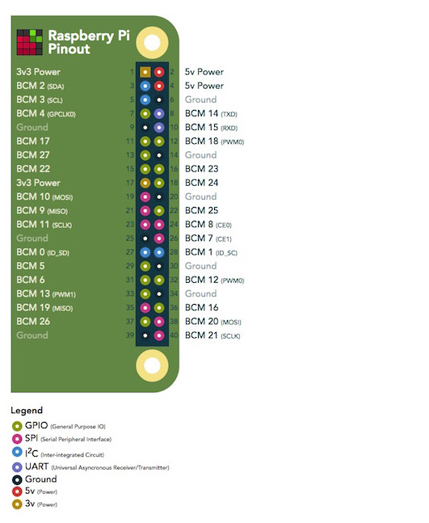

# Creative Embedded Systems - Module 1: Generative Art

This piece is for those who have become partially nocturnal during the pandemic and are craving some natural light. I love sunlight and natural light, but frequently I don’t get myself outside early enough in the day to really enjoy it. On the other hand, I dislike the aesthetics of LEDs because to me they have always looked like the antithesis of natural light. The concept for my project was simple and aesthetically driven: my goal was to imitate the experience of natural light for the viewer, particularly natural sunlight, contradictorily using the artificial light from the LEDs and the monitor.

A video demo can be found [here](https://youtu.be/GxhtRcsm3iU)

## Processing
Information about installing Processing on your Raspberry Pi can be found [here](https://pi.processing.org/download/)

Essentially all you have to do is run this command in the terminal: 
```
curl https://processing.org/download/install-arm.sh | sudo sh
```

## Wiring

A detailed guide to setting up the wiring can be found [here](https://learn.adafruit.com/neopixels-on-raspberry-pi/raspberry-pi-wiring).

Here is a diagram of the Raspberry Pi 4B pinout: 



I connected the input control signal(S) on the LED module to GPIO21 on the Pi, the input power supply pin(V) on the LED module to 5V on the Pi, and the input ground(G) on the LED module to ground on the PI. 

Here is a photo of my setup: 

{:height="50%" width="50%"}

Here, red is power, black is ground, and brown is signal.

If GPIO18 works for your code instead of GPIO21, you also have to change code on line 7 in the weather_led.py file as follows
```
pixels = neopixel.NeoPixel(board.D18, 8, brightness=0.1, auto_write=False, pixel_order=neopixel.RGB)
```

## NeoPixels

In order to use the Adafruit_Blinka library run the following commands: 
```
sudo pip3 install rpi_ws281x adafruit-circuitpython-neopixel
sudo python3 -m pip install --force-reinstall adafruit-blinka
```
Make sure later when you run your code, you use python3. You must also use sudo.

Sample command for running the python script:

```
sudo python3 weather_led.py
```

## Calling the Weather API
First run `pip install requests` to install the Python package that allows you to easily make HTTPS requests. 

Then make an account on https://openweathermap.org to get your own API key. 

Create a file called env.json. The .gitignore automatically ignores this file if you keep it in the same directory as you other files in the repo, so you don't share your private key. In the file simply put the following text, inserting your API key: 
```
{
"API_KEY": "YOUR API KEY GOES HERE"
}
```

Edit sure to edit line 11 in weather_led.py file to match the location of your env.json file. The absolute file path is needed here for running on boot!


## Running on Boot
Run the command `vi /home/pi/.bashrc`

At the end of file include the following line: 

```
/home/pi/[Your File Path]/Project_1/autorun.sh
```
 This should run the shellscript autorun.sh, which is an executable and will run your other programs. If you have difficulties running it make sure it is an execulatle by running `chmod 755 autorun.sh`

I found it also helpful to include the line `echo Running at boot` for testing purposes. 


